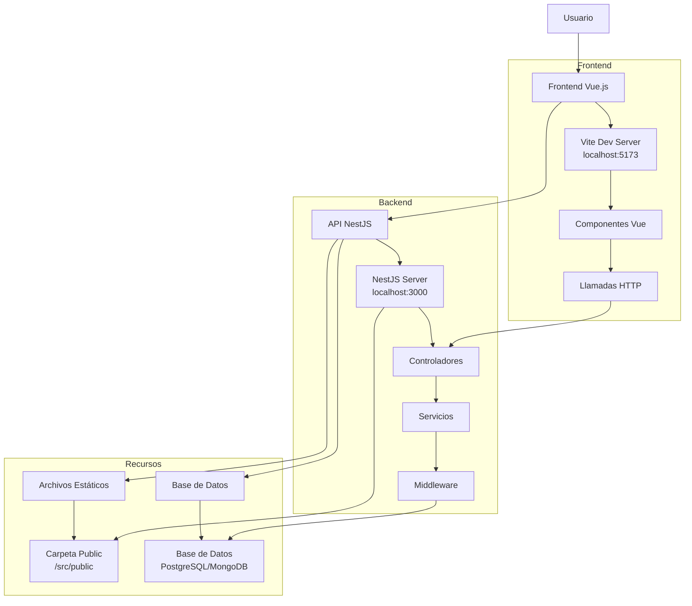

# Arquitectura del Sistema CloserClick

## Diagrama de Flujo de la Arquitectura



## Estructura del Proyecto

```
closerclick/
├── api/                    # Backend NestJS
│   ├── src/
│   │   ├── public/         # Archivos estáticos
│   │   ├── main.ts         # Configuración del servidor
│   │   ├── app.controller.ts
│   │   ├── app.service.ts
│   │   └── app.module.ts
│   └── package.json
├── frontend/               # Frontend Vue.js
│   ├── src/
│   │   ├── App.vue         # Componente principal
│   │   ├── main.ts         # Punto de entrada
│   │   └── components/
│   └── package.json
└── package.json            # Scripts globales
```

## Flujo de Datos

1. **Frontend (Vue.js + TypeScript)**
   - Usuario interactúa con la aplicación
   - Componentes Vue realizan llamadas HTTP a la API
   - Manejo de estado y actualización de la UI

2. **Backend (NestJS)**
   - Recibe requests HTTP en `/api/*`
   - Controladores procesan las rutas
   - Servicios implementan la lógica de negocio
   - Middleware para validación y autenticación

3. **Recursos Estáticos**
   - Archivos servidos desde `/src/public`
   - Accesibles en `/public/*`
   - Configurados en `main.ts`

## Endpoints de la API

- `GET /api` - Mensaje de bienvenida
- `GET /api/health` - Estado del sistema
- `GET /public/*` - Archivos estáticos

## Configuración de Puertos

- **API NestJS**: `localhost:3000`
- **Frontend Vite**: `localhost:5173`
- **CORS**: Configurado para permitir comunicación entre puertos

## Scripts Disponibles

```bash
# Desarrollo
npm run dev:api        # Inicia API NestJS
npm run dev:frontend   # Inicia frontend Vite

# Build
npm run build:api      # Compila API
npm run build:frontend # Compila frontend
```

## Tecnologías Utilizadas

- **Backend**: NestJS, TypeScript, Express
- **Frontend**: Vue 3, TypeScript, Vite
- **Servidor de Archivos**: Express Static
- **Gestión de Paquetes**: npm