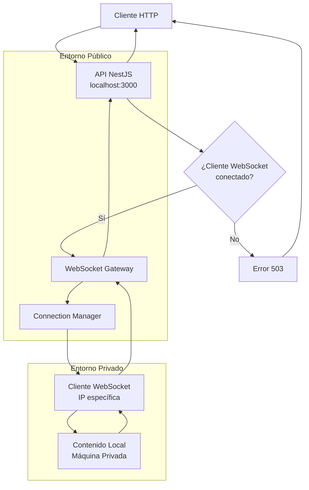

# Arquitectura del Sistema CloserClick

## Diagrama de Flujo del Proxy WebSocket



## Estructura del Proyecto

```
closerclick/
├── api/                    # Backend NestJS con WebSocket
│   ├── src/
│   │   ├── proxy/          # Sistema de proxy
│   │   │   ├── proxy.controller.ts    # Controlador de proxy
│   │   │   ├── proxy.service.ts       # Servicio de proxy
│   │   │   ├── connection-manager.service.ts # Gestor de conexiones
│   │   │   └── stats.controller.ts    # Estadísticas
│   │   ├── websocket/      # Gateway WebSocket
│   │   │   ├── websocket.gateway.ts   # Gateway principal
│   │   │   └── connection-manager.service.ts
│   │   ├── types/          # Tipos TypeScript
│   │   │   └── websocket.types.ts
│   │   ├── main.ts         # Configuración del servidor
│   │   ├── app.controller.ts
│   │   ├── app.service.ts
│   │   └── app.module.ts
│   └── package.json
├── frontend/               # Frontend Vue.js para monitoreo
│   ├── src/
│   │   ├── App.vue         # Componente principal
│   │   ├── main.ts         # Punto de entrada
│   │   └── components/
│   └── package.json
├── docs/                   # Documentación
└── sample/                 # Ejemplos y clientes de prueba
```

## Flujo de Datos del Proxy

1. **Cliente WebSocket se conecta**
   - Cliente se conecta al WebSocket Gateway
   - Se registra su IP en el ConnectionManager
   - Se crea un endpoint específico para esa IP

2. **Cliente HTTP hace request**
   - Request a `/{ip}/*` donde `{ip}` es la IP del cliente WebSocket
   - ProxyController extrae la IP y ruta
   - Busca cliente WebSocket correspondiente

3. **Comunicación WebSocket**
   - Request se envía al cliente WebSocket via Socket.IO
   - Cliente WebSocket procesa el request localmente
   - Retorna respuesta via WebSocket

4. **Respuesta al Cliente HTTP**
   - API recibe respuesta del WebSocket
   - Decodifica contenido (base64 si es binario)
   - Retorna respuesta HTTP al cliente original

## Endpoints de la API

### API Principal
- `GET /api` - Mensaje de bienvenida
- `GET /api/health` - Estado del sistema
- `GET /api/stats` - Estadísticas de conexiones WebSocket

### Sistema de Proxy
- `GET/POST/PUT/DELETE /{ip}/*` - Proxy de contenido para IP específica
- `GET /{ip}` - Verificar conexión de cliente WebSocket

### Debug
- `GET /api/debug/myip` - Obtener IP del cliente

## Configuración de Puertos

- **API NestJS**: `localhost:3000`
- **Frontend Vite**: `localhost:5173`
- **CORS**: Configurado para permitir comunicación entre puertos

## Scripts Disponibles

```bash
# Desarrollo
npm run dev:api        # Inicia API NestJS
npm run dev:frontend   # Inicia frontend Vite

# Build
npm run build:api      # Compila API
npm run build:frontend # Compila frontend
```

## Tecnologías Utilizadas

- **Backend**: NestJS, TypeScript, Express, Socket.IO
- **Frontend**: Vue 3, TypeScript, Vite
- **WebSocket**: Socket.IO para comunicación bidireccional
- **Proxy**: Sistema de proxy basado en IP
- **Gestión de Paquetes**: npm