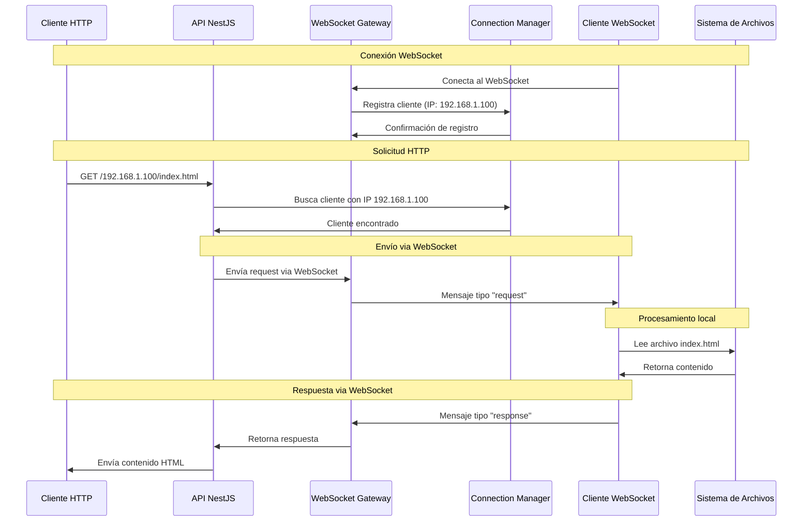
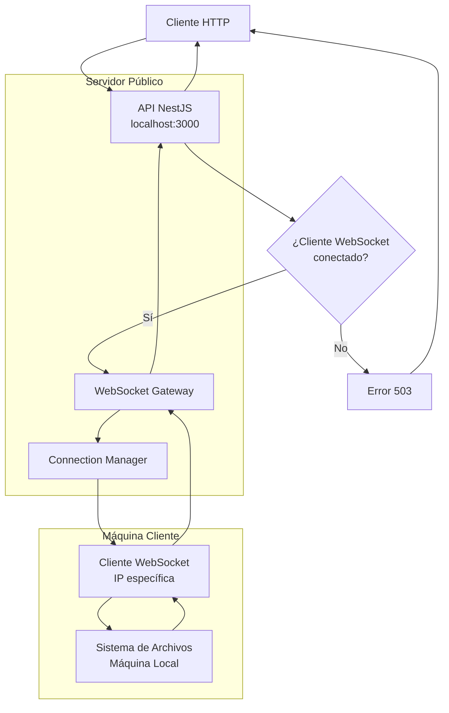

# Diagrama de Comunicación - CloserClick

## Flujo de Comunicación del Proxy WebSocket

## Arquitectura de Comunicación

## Componentes del Sistema

### 1. **API NestJS**
- **Puerto**: 3000
- **Responsabilidades**:
  - Procesar solicitudes HTTP en `/{ip}/*`
  - Gestionar conexiones WebSocket via Socket.IO
  - Coordinar comunicación con clientes WebSocket
  - Retornar contenido al cliente HTTP

### 2. **WebSocket Gateway**
- **Función**: Manejar conexiones WebSocket persistentes
- **Protocolo**: Socket.IO sobre WebSocket
- **Autenticación**: Basada en IP del cliente
- **Registro**: Connection Manager por IP

### 3. **Connection Manager**
- **Función**: Gestionar registro de clientes conectados
- **Mapeo**: IP → Socket ID
- **Timeout**: 30 segundos para requests
- **Estadísticas**: Monitoreo de conexiones activas

### 4. **Proxy Controller**
- **Endpoints**: `/{ip}/*` para cualquier método HTTP
- **Función**: Extraer IP y ruta, enrutar a cliente WebSocket
- **Codificación**: Base64 para contenido binario

### 5. **Cliente WebSocket**
- **Ubicación**: Cualquier máquina con acceso a contenido
- **Función**: Servir contenido local via WebSocket
- **Protocolo**: Mensajes tipo "request" y "response"

## Flujo Detallado

### Fase 1: Conexión WebSocket
1. Cliente WebSocket se conecta al servidor en `ws://localhost:3000`
2. WebSocket Gateway registra la conexión con su IP
3. Connection Manager almacena el mapeo IP → Socket ID
4. Se crea endpoint HTTP específico para esa IP

### Fase 2: Solicitud HTTP
1. Cliente HTTP accede a `http://localhost:3000/{ip}/ruta`
2. ProxyController extrae la IP y ruta del request
3. Busca en Connection Manager si hay cliente con esa IP
4. Si no existe, retorna error 503

### Fase 3: Comunicación WebSocket
1. ProxyService envía request via WebSocket al cliente
2. Mensaje tipo "request" con método, ruta, headers y body
3. Cliente WebSocket procesa el request localmente
4. Lee archivo del sistema de archivos local

### Fase 4: Respuesta HTTP
1. Cliente WebSocket envía respuesta tipo "response"
2. Connection Manager correlaciona request/response
3. ProxyController decodifica contenido (base64 si es binario)
4. Retorna respuesta HTTP al cliente original

## Consideraciones de Seguridad

- **Firewall**: La máquina privada está protegida
- **WebSocket**: Conexión segura y autenticada
- **Proxy**: El API actúa como intermediario seguro
- **Contenido**: Solo HTML es retornado al usuario

## Configuración de Puertos y URLs

| Componente | URL/Puerto | Propósito |
|------------|------------|-----------|
| API NestJS | `localhost:3000` | Servidor principal |
| WebSocket | `ws://localhost:3000` | Comunicación WebSocket |
| Proxy HTTP | `/{ip}/*` | Proxy de contenido |
| API Health | `/api/health` | Estado del sistema |
| API Stats | `/api/stats` | Estadísticas |

## Dependencias y Requisitos

- **Conexión WebSocket**: Requerida para proxy de contenido
- **Cliente WebSocket**: Aplicación que sirve contenido local
- **Timeout**: 30 segundos máximo por request
- **Base64**: Codificación para contenido binario
- **CORS**: Configurado para desarrollo (`origin: '*'`)