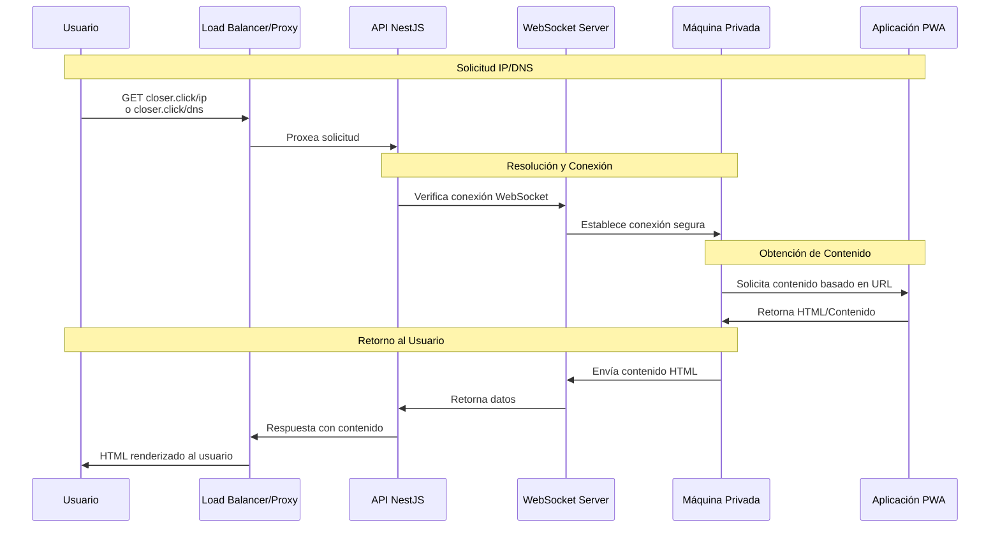
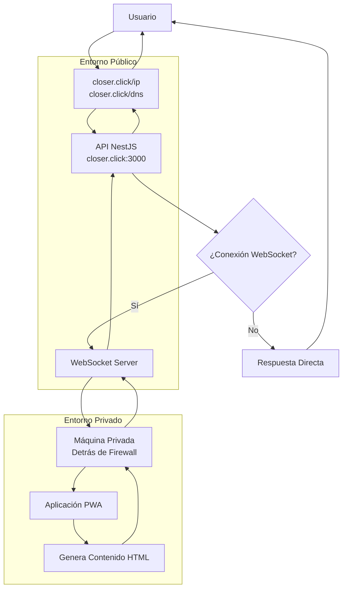

# Diagrama de Comunicación - CloserClick

## Flujo de Comunicación del Sistema

## Arquitectura de Comunicación

## Componentes del Sistema

### 1. **Frontend Público**
- **Dominio**: `closer.click`
- **Endpoints**:
  - `/ip` - Resolución de direcciones IP
  - `/dns` - Consultas de DNS
- **Función**: Proxy inicial y enrutamiento

### 2. **API NestJS**
- **Puerto**: 3000
- **Responsabilidades**:
  - Procesar solicitudes HTTP
  - Gestionar conexiones WebSocket
  - Coordinar comunicación con máquina privada
  - Retornar contenido HTML al usuario

### 3. **Servidor WebSocket**
- **Función**: Conexión persistente con máquina privada
- **Protocolo**: WebSocket seguro
- **Autenticación**: Tokens/credenciales específicas

### 4. **Máquina Privada**
- **Ubicación**: Detrás de firewall corporativo
- **Acceso**: Solo mediante WebSocket autorizado
- **Función**: Host de la aplicación PWA

### 5. **Aplicación PWA**
- **Tipo**: Progressive Web App
- **Responsabilidad**: Generar contenido HTML dinámico
- **Comunicación**: Via WebSocket con API pública

## Flujo Detallado

### Fase 1: Solicitud del Usuario
1. Usuario accede a `closer.click/ip` o `closer.click/dns`
2. Load balancer/proxy recibe la solicitud
3. Request es enrutado al API NestJS

### Fase 2: Procesamiento del API
1. API valida la solicitud
2. Verifica si existe conexión WebSocket activa
3. Si hay conexión, procede con la solicitud
4. Si no hay conexión, retorna error o intenta establecerla

### Fase 3: Comunicación con Máquina Privada
1. WebSocket Server envía solicitud a máquina privada
2. Máquina privada ejecuta la aplicación PWA
3. PWA genera contenido basado en la URL solicitada
4. Contenido HTML es retornado a través del WebSocket

### Fase 4: Respuesta al Usuario
1. API recibe el contenido HTML
2. Formatea la respuesta HTTP
3. Retorna el HTML al usuario final
4. Usuario ve el contenido renderizado

## Consideraciones de Seguridad

- **Firewall**: La máquina privada está protegida
- **WebSocket**: Conexión segura y autenticada
- **Proxy**: El API actúa como intermediario seguro
- **Contenido**: Solo HTML es retornado al usuario

## Configuración de Puertos y URLs

| Componente | URL/Puerto | Propósito |
|------------|------------|-----------|
| Frontend Público | `closer.click` | Punto de entrada |
| API NestJS | `closer.click:3000` | Procesamiento backend |
| WebSocket | `wss://closer.click/ws` | Comunicación privada |
| Máquina Privada | Interno | Host PWA |
| PWA | Interno | Generación contenido |

## Dependencias y Requisitos

- **Conexión WebSocket**: Requerida para acceso a máquina privada
- **Autenticación**: Credenciales para conexión segura
- **Firewall**: Configuración para permitir WebSocket específico
- **PWA**: Aplicación funcionando en máquina privada